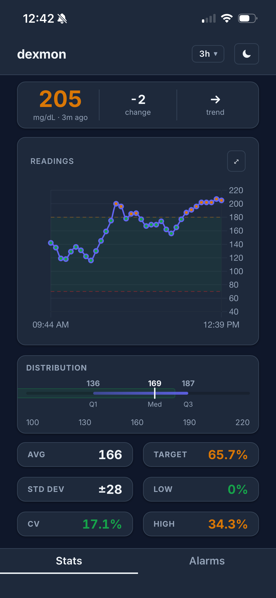
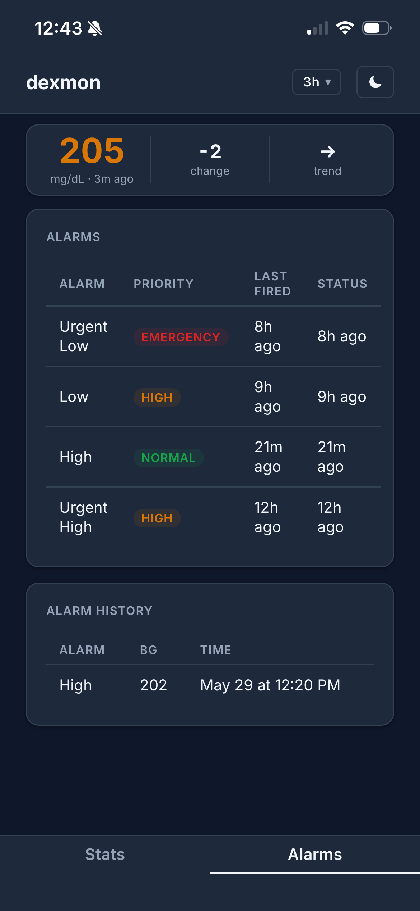

# dexmon

A long-running Go daemon that monitors a Dexcom Share CGM account, evaluates configurable alarm rules, and sends Pushover notifications. Every poll interval it fetches the latest reading; when blood glucose crosses a threshold and the current trend matches the configured filter, a notification is dispatched. Emergency alarms retry until acknowledged — when a recipient acknowledges from the Pushover app, dexmon's webhook stops retrying and can optionally snooze further alerts for that recipient.

---

## Dashboard

The dashboard is available at `https://<appname>.fly.dev/` and auto-refreshes every 5 minutes.

<p align="center">
  
  &nbsp;&nbsp;
  
</p>

The dashboard has two tabs — **Stats** and **Alarms**:

**Stats tab**

| Widget | Shows |
|--------|-------|
| Current BG | Value, trend arrow (↑↑ ↑ ↗ → ↘ ↓ ↓↓), and time since reading |
| BG Graph | Line chart with a shaded target range band; hover a point to see the exact BG value and timestamp. ⤢ expands to fullscreen — ESC exits. |
| Distribution | Strip plot showing quartiles and median across the selected window |
| Avg | Integer average BG over the selected window |
| Std Dev | Standard deviation |
| CV | Coefficient of variation (%) |
| Target % | Percentage of readings within the target range |
| Low % | Percentage of readings below target |
| High % | Percentage of readings above target |

**Alarms tab**

| Widget | Shows |
|--------|-------|
| Alarms | Per-alarm name, Pushover priority, last fired time, and current status |
| Alarm History | Chronological log of every alarm firing within the selected window: alarm name, BG at fire time, and timestamp (newest first) |

Time window dropdown in the header controls the range shown across all widgets. Supports light and dark themes — toggle with the moon button in the header. Preferences are saved across page loads.

---

## Deploy to Fly.io

Fly.io is the recommended way to run dexmon. You get a persistent database volume, automatic HTTPS (required for emergency alarm callbacks), and a machine that runs 24/7. The free tier is sufficient.

### Prerequisites

- **flyctl** installed:
  ```bash
  curl -L https://fly.io/install.sh | sh
  ```
- A **Fly.io account** at [fly.io](https://fly.io) — free, no credit card required
- A **Pushover** account at [pushover.net](https://pushover.net) with an application created
- **Dexcom Share** enabled on the patient's Dexcom G-series app (Settings → Share → Invite Followers)

### 1. Gather your credentials

You need three things before running the deploy script.

**Pushover app token**

Go to [pushover.net](https://pushover.net) → scroll to **Your Applications** → click your app → copy the **API Token/Key**. This is your `PUSHOVER_APP_TOKEN`.

**Pushover user key**

On [pushover.net](https://pushover.net), your **User Key** is shown at the top of the page after logging in. Each person who receives notifications needs their own user key — this is `PUSHOVER_USER_KEY_<NAME>`.

**Dexcom credentials**

The email address and password used to log in to the Dexcom mobile app. These are `DEXCOM_USER_<NAME>` and `DEXCOM_PASS_<NAME>`.

### 2. Prepare config.toml

```bash
cp config.toml.example config.toml
```

Open `config.toml` and fill in your alarm rules, thresholds, and recipient names. Leave all `${VARIABLE_NAME}` placeholders exactly as they are — **do not replace them with real credentials**.

> **How `${VAR}` placeholders work:** Every credential in `config.toml` is written as `${VARIABLE_NAME}` — a placeholder, never the real value. The deploy script scans the file, finds each placeholder, and prompts you for the actual value. Your credentials go directly into Fly's encrypted secret store and never touch your disk. You type each value once at the prompt; that's it. This also means you can safely commit or share `config.toml` without exposing any secrets.

Leave `callback_url = ""` for now — you will fill this in after the first deploy.

### 3. Run `./fly/deploy.sh`

```bash
./fly/deploy.sh
```

The script walks you through three prompts before deploying.

**App name**

Choose a name that is unique across all Fly.io users — `dexmon` is already taken. The dashboard is publicly available so dont use a name that might identify you. . This becomes your URL: `https://<appname>.fly.dev`.

**Region**

The Fly.io data center closest to you:

| Code | Location |
|------|----------|
| `iad` | Northern Virginia (US East) |
| `ord` | Chicago (US Central) |
| `lax` | Los Angeles (US West) |
| `lhr` | London (Europe) |
| `syd` | Sydney (Australia) |

Full list: [fly.io/docs/reference/regions](https://fly.io/docs/reference/regions/)

**Secret prompts**

The script finds every `${VAR}` placeholder in your `config.toml` and asks for its value one at a time:

```
Value for PUSHOVER_APP_TOKEN (NEW — required):
```

> **Nothing appears as you type — this is normal.** Input is hidden to protect your credentials. Paste or type the value and press Enter.

Each prompt name tells you exactly which credential is needed:

| Prompt | What to enter |
|--------|--------------|
| `PUSHOVER_APP_TOKEN` | API Token/Key — pushover.net → Your Applications → click your app |
| `PUSHOVER_USER_KEY_<NAME>` | User Key — pushover.net, shown at top of page after login |
| `DEXCOM_USER_<NAME>` | Dexcom login email |
| `DEXCOM_PASS_<NAME>` | Dexcom login password |
| `HEALTHCHECKS_PING_URL` | Ping URL from healthchecks.io — leave blank if not using |

After all prompts, the script creates the Fly app, provisions a 1 GB persistent volume for the database, uploads your secrets, and builds and deploys the container remotely.

### 4. Set the callback URL

> Complete Step 3 first — the app must finish deploying before you have a URL to set.

After the first deploy your app is live at `https://<appname>.fly.dev`. Open `config.toml` and update — replacing `<appname>` with the name you chose in Step 3 (for example, `dexmon-noah`):

```toml
[server]
callback_url = "https://<appname>.fly.dev/pushover/callback"
```

Then push the updated config:

```bash
./fly/update.sh
```

Choose **option 1** (Config file). The script re-encodes `config.toml` and redeploys.

### 5. Verify

```bash
fly logs --app <appname>
```

Healthy output looks like:

```
[noah] reading: 142 → (no alarm)
[noah] reading: 138 → (no alarm)
```

A new line appears every poll interval. The dashboard is live at `https://<appname>.fly.dev/`.

### Automate deploys with CI/CD

To automatically redeploy on every push to `main`, see [guides/github-actions.md](guides/github-actions.md).

---

## Configuration

All configuration lives in a single TOML file. Secrets are referenced as `${ENV_VAR_NAME}` and are expanded from the environment at startup — the literal `${...}` tokens are never written to the config file.

**Accounts** are the Dexcom Share logins dexmon monitors — one entry per patient. **Recipients** are the people who receive Pushover notifications. They are separate: multiple recipients can watch the same account, and each has independent snooze and backoff state. A recipient who silences an alarm does not affect what others receive.

### `[server]`

```toml
[server]
callback_port = 8080
callback_url  = "https://your-domain.com/pushover/callback"
```

| Key | Description |
|---|---|
| `callback_port` | Local port the server listens on. Serves the web dashboard at `/` and the Pushover webhook at `/pushover/callback`. |
| `callback_url` | Public URL Pushover uses to deliver acknowledgments. Must be reachable from the internet for emergency alarms to support acknowledgment/snooze. |

### `[health]`

```toml
[health]
  [health.dexcom_timeout]
  max_missed_readings = 3
  priority            = "emergency"
  recipients          = ["brandon"]

  [health.watchdog]
  ping_url = "${HEALTHCHECKS_PING_URL}"
```

**`[health.dexcom_timeout]`** — fires a Pushover alert when polling fails `max_missed_readings` times in a row for an account.

| Key | Description |
|---|---|
| `max_missed_readings` | Number of consecutive failed polls before alerting. Must be > 0 when recipients are configured. |
| `priority` | Pushover priority: `normal`, `high`, or `emergency` |
| `recipients` | List of recipient names to notify (must exist in `[recipients]`) |

**`[health.watchdog]`** — dead man's switch. dexmon pings `ping_url` after every successful poll. If pings stop (process crashed, host down), the external service sends its own alert.

| Key | Description |
|---|---|
| `ping_url` | URL to GET on each successful poll. Works with healthchecks.io (free tier), BetterUptime, etc. Leave empty to disable. |

### `[recipients]`

Define one entry per person who can receive notifications.

```toml
[recipients]
  [recipients.brandon]
  pushover_user_key = "${PUSHOVER_USER_KEY_BRANDON}"

  [recipients.sarah]
  pushover_user_key = "${PUSHOVER_USER_KEY_SARAH}"
```

| Key | Description |
|---|---|
| `pushover_user_key` | Pushover user key for this recipient — shown at the top of pushover.net after logging in |

Recipient names are referenced by `recipients = [...]` in alarms. The name is arbitrary — it just needs to match consistently.

### `[accounts]`

Define one entry per Dexcom Share account to monitor.

```toml
[accounts]
  [accounts.jessica]
  dexcom_username = "${DEXCOM_USER_JESSICA}"
  dexcom_password = "${DEXCOM_PASS_JESSICA}"
  poll_interval   = "5m"
  target_low      = 70   # optional, default 70
  target_high     = 180  # optional, default 180
```

| Key | Description |
|---|---|
| `dexcom_username` | Dexcom Share login email |
| `dexcom_password` | Dexcom Share login password |
| `poll_interval` | How often to poll for a new reading. Go duration string: `5m`, `3m`, etc. Dexcom updates every 5 minutes. |
| `target_low` | Lower bound of the target BG range (mg/dL). Controls dashboard color coding and chart band. Default: `70`. |
| `target_high` | Upper bound of the target BG range (mg/dL). Controls dashboard color coding and chart band. Default: `180`. |

### `[[accounts.<name>.alarms]]`

Each account can have multiple alarms. Each alarm is a `[[accounts.<name>.alarms]]` table.

```toml
[[accounts.jessica.alarms]]
name              = "Severe Low"
threshold         = 55
direction         = "below"
trend             = ["double_up", "single_up", "forty_five_up", "flat",
                     "forty_five_down", "single_down", "double_down",
                     "not_computable", "rate_out_of_range", "none"]
priority          = "emergency"
retry             = "5m"
expire            = "2h"
rearm_on_recovery = true
recipients        = ["brandon", "sarah", "jessica"]
```

| Key | Type | Description |
|---|---|---|
| `name` | string | Human-readable alarm name (appears in notifications) |
| `threshold` | integer | Blood glucose value in mg/dL |
| `direction` | `above` / `below` | Alarm fires when BG is above or below the threshold |
| `trend` | list of trends | Alarm fires only when the current trend is in this list. Use all trends to fire regardless of direction. |
| `priority` | `normal` / `high` / `emergency` | Pushover priority. Emergency bypasses quiet hours and retries until acknowledged. |
| `retry` | duration | **Emergency only.** How often Pushover re-notifies if unacknowledged (e.g. `"5m"`). |
| `expire` | duration | **Emergency only.** How long Pushover keeps retrying (e.g. `"2h"`). |
| `backoff` | duration | **Non-emergency.** Minimum time between repeat fires for the same alarm per recipient. Omit to fire every poll. |
| `rearm_on_recovery` | bool | If `true`, backoff and snooze reset when BG recovers past the threshold. If `false`, original backoff is honored across recoveries. |
| `recipients` | list of names | Which recipients to notify. Each gets an individual notification; one person's snooze does not affect others. |

#### Trend values

| Value | Arrow | Meaning |
|---|---|---|
| `double_up` | ↑↑ | Rising rapidly |
| `single_up` | ↑ | Rising |
| `forty_five_up` | ↗ | Rising slightly |
| `flat` | → | Stable |
| `forty_five_down` | ↘ | Falling slightly |
| `single_down` | ↓ | Falling |
| `double_down` | ↓↓ | Falling rapidly |
| `not_computable` | ? | Sensor cannot compute trend |
| `rate_out_of_range` | — | Rate too extreme to classify |
| `none` | | No trend data |

---

## Alarm Priority Reference

| Config priority | Behavior |
|---|---|
| `normal` | Standard Pushover notification, respects quiet hours |
| `high` | Bypasses Pushover quiet hours |
| `emergency` | Retries every `retry` until acknowledged or `expire` elapsed; supports callback acknowledgment and snooze |

---

## Updating

Run `./fly/update.sh` whenever you need to make changes:

| Option | When to use |
|--------|-------------|
| **1. Config file** | Changed alarm rules, thresholds, or `callback_url` |
| **2. Secrets** | Rotated a Dexcom or Pushover credential |
| **3. Code only** | Pulled new code from git, no config or secret changes |
| **4. Everything** | Changed config and rotated secrets at the same time |

Options 1, 2, and 4 automatically redeploy so changes take effect immediately.

---

## Other Deployment Methods

- **Local test run** — [guides/local-run.md](guides/local-run.md). Runs on your machine with no persistent storage and no public callback URL. Suitable for verifying configuration; not for production.
- **Raspberry Pi** — [guides/raspberry-pi.md](guides/raspberry-pi.md). Always-on self-hosted option using systemd and Cloudflare Tunnel for callbacks.
